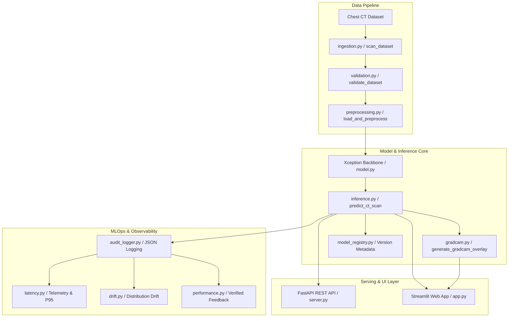

# 🫁 Explainable Lung Cancer Classification & Production MLOps Engineering System

[](https://explainable-lung-cancer-classification-uhx8avwtk2utzx78rxrs3z.streamlit.app/)
[](https://www.python.org/)
[](https://www.tensorflow.org/)
[](https://fastapi.tiangolo.com/)
[](https://docs.pytest.org/)

> 🚀 **LIVE DEMO:** Access the fully interactive Streamlit application deployed on Streamlit Cloud:  
> 👉 **[https://explainable-lung-cancer-classification-uhx8avwtk2utzx78rxrs3z.streamlit.app/](https://explainable-lung-cancer-classification-uhx8avwtk2utzx78rxrs3z.streamlit.app/)**

---

> ⚠️ **MEDICAL DISCLAIMER:** For educational and research purposes only. This application is a research prototype and engineering project, NOT a medical diagnostic tool. It must not be used for clinical decision-making or patient diagnosis.

---

## 📌 Project Overview
This project presents an **end-to-end Machine Learning Engineering system** built on a 2-stage transfer learning **Xception** neural network architecture for multi-class chest CT lung cancer classification (**Adenocarcinoma**, **Large Cell Carcinoma**, **Normal**, **Squamous Cell Carcinoma**).

The project is structured around a modular, production-oriented MLOps architecture specifically aligned with **AI/ML Engineer** job requirements (such as UnitedHealth Group / Optum), incorporating automated dataset validation, FastAPI REST endpoints, real-time latency telemetry, statistical data drift monitoring, confidence thresholding, and Grad-CAM interpretability.

---

## 🌟 Key System Capabilities

- **🫁 4-Class Deep Learning Classifier:** Xception architecture pre-trained on ImageNet with fine-tuned top layers achieving **76.51% test accuracy** and **0.7859 macro F1-score**.
- **🔬 Visual Interpretability (Grad-CAM):** Gradient-weighted Class Activation Mapping highlighting anatomical decision features on chest CT scans.
- **⚡ High-Performance REST API:** Built with FastAPI featuring OpenAPI documentation (`/predict`, `/health`, `/metrics`, `/model/info`, `/monitoring/summary`, `/feedback`).
- **🛡️ Responsible AI & Human-in-the-Loop:** Automatic confidence classification (`HIGH` >= 80%, `MEDIUM` 60-79%, `LOW` < 60%) triggering human review flags for low-confidence inferences.
- **📈 MLOps Monitoring & Telemetry:** Real-time latency measurement (avg, p95), statistical input distribution drift detection, and verified ground-truth feedback loop.
- **🐳 Docker Containerization:** Multi-service `docker-compose` setup for Streamlit UI and FastAPI backend.

---

## 🏗️ End-to-End System Architecture



---

## 🎯 Optum AI/ML Engineer Job Alignment Checklist

| JD Requirement Category | Implemented System Feature | Primary File / Module | Verification / Evidence |
| :--- | :--- | :--- | :--- |
| **Machine Learning Development** | 4-Class CT scan classifier, transfer learning, hyperparameter tuning | [`src/models/model.py`](file:///c:/Users/Deeksha/OneDrive/Desktop/Explainable-Lung-Cancer-Classification-main/src/models/model.py), [`src/training/train.py`](file:///c:/Users/Deeksha/OneDrive/Desktop/Explainable-Lung-Cancer-Classification-main/src/training/train.py) | 2-Stage Xception fine-tuning pipeline |
| **Predictive Analytics & EDA** | Automated dataset health scanner & class distribution breakdown | [`src/data/ingestion.py`](file:///c:/Users/Deeksha/OneDrive/Desktop/Explainable-Lung-Cancer-Classification-main/src/data/ingestion.py) | `scan_dataset()` summary report |
| **Feature Engineering** | 2048-dim intermediate Xception representation embeddings | [`src/features/feature_pipeline.py`](file:///c:/Users/Deeksha/OneDrive/Desktop/Explainable-Lung-Cancer-Classification-main/src/features/feature_pipeline.py) | `FeatureExtractor.extract_batch()` |
| **REST API Serving** | FastAPI endpoints (`/predict`, `/health`, `/metrics`, `/feedback`) | [`src/api/server.py`](file:///c:/Users/Deeksha/OneDrive/Desktop/Explainable-Lung-Cancer-Classification-main/src/api/server.py) | OpenAPI docs at `/docs` |
| **Model Registry & Versioning** | Local JSON model registry with SHA256 checksums | [`src/models/model_registry.py`](file:///c:/Users/Deeksha/OneDrive/Desktop/Explainable-Lung-Cancer-Classification-main/src/models/model_registry.py) | [`models/model_registry.json`](file:///c:/Users/Deeksha/OneDrive/Desktop/Explainable-Lung-Cancer-Classification-main/models/model_registry.json) |
| **Operational Telemetry** | Inference latency measurement (avg, p95), confidence scoring | [`src/monitoring/latency.py`](file:///c:/Users/Deeksha/OneDrive/Desktop/Explainable-Lung-Cancer-Classification-main/src/monitoring/latency.py) | `get_latency_stats()` |
| **Data Drift Detection** | Statistical intensity profile & distribution drift comparison | [`src/monitoring/drift.py`](file:///c:/Users/Deeksha/OneDrive/Desktop/Explainable-Lung-Cancer-Classification-main/src/monitoring/drift.py) | `detect_data_drift()` |
| **Performance Feedback** | Post-deployment ground-truth feedback collection & metric updates | [`src/monitoring/performance.py`](file:///c:/Users/Deeksha/OneDrive/Desktop/Explainable-Lung-Cancer-Classification-main/src/monitoring/performance.py) | `log_ground_truth_feedback()` |
| **Explainable AI** | Grad-CAM heatmaps on target convolutional activations | [`src/explainability/gradcam.py`](file:///c:/Users/Deeksha/OneDrive/Desktop/Explainable-Lung-Cancer-Classification-main/src/explainability/gradcam.py) | Jet colormap overlay visualizations |
| **Responsible AI & Human Oversight**| Automated triggers for low-confidence (<60%) predictions | [`src/models/inference.py`](file:///c:/Users/Deeksha/OneDrive/Desktop/Explainable-Lung-Cancer-Classification-main/src/models/inference.py) | `requires_human_review` flag |
| **Containerization** | Production-ready Docker container & Docker Compose setup | [`Dockerfile`](file:///c:/Users/Deeksha/OneDrive/Desktop/Explainable-Lung-Cancer-Classification-main/Dockerfile), [`docker-compose.yml`](file:///c:/Users/Deeksha/OneDrive/Desktop/Explainable-Lung-Cancer-Classification-main/docker-compose.yml) | Multi-service orchestration |
| **Automated Testing** | Pytest unit test suite covering API, inference, drift, & pipeline | [`tests/`](file:///c:/Users/Deeksha/OneDrive/Desktop/Explainable-Lung-Cancer-Classification-main/tests/) | 12 passing unit tests |

---

## 📊 Actual Measured Model Results

Evaluated on the isolated 315-image test split:

| Metric | Score | Note |
| :--- | :--- | :--- |
| **Test Accuracy** | **76.51%** | 241 / 315 correct predictions |
| **Macro Precision** | **0.8063** | Unweighted average across 4 classes |
| **Macro Recall** | **0.7983** | Unweighted recall average |
| **Macro F1-Score** | **0.7859** | Balanced evaluation metric |
| **Weighted F1-Score** | **0.7623** | Class-weighted F1 |

### Confusion Matrix Summary
- **Adenocarcinoma:** 69 correct, 8 Large Cell, 3 Normal, 40 Squamous Cell
- **Large Cell Carcinoma:** 37 correct, 2 Adeno, 12 Squamous Cell
- **Normal:** 53 correct (98.15% recall, 94.64% precision)
- **Squamous Cell Carcinoma:** 82 correct (91.11% recall)

---

## 📂 Modular Repository Structure

```
Explainable-Lung-Cancer-Classification/
│
├── app.py                         # Streamlit 12-module web application
├── requirements.txt               # Lightweight dependencies for Streamlit Cloud
├── README.md                      # Comprehensive Optum-aligned documentation
├── Dockerfile                     # Containerization setup
├── docker-compose.yml             # Streamlit + FastAPI orchestration
├── conftest.py                    # Pytest environment configuration
├── .gitignore                     # Clean repository rules
│
├── src/                           # Modular Engineering Packages
│   ├── config.py                  # Global settings, paths, & thresholds
│   │
│   ├── data/                      # Ingestion, validation, & preprocessing
│   │   ├── ingestion.py
│   │   ├── preprocessing.py
│   │   └── validation.py
│   │
│   ├── features/                  # Xception embedding feature extraction
│   │   └── feature_pipeline.py
│   │
│   ├── models/                    # Architecture, inference, & registry
│   │   ├── model.py
│   │   ├── inference.py
│   │   └── model_registry.py
│   │
│   ├── training/                  # Fine-tuning, tuning, benchmarking, promotion
│   │   ├── train.py
│   │   ├── tune.py
│   │   ├── benchmark.py
│   │   └── promote_model.py
│   │
│   ├── evaluation/                # Evaluation & metric calculation
│   │   ├── evaluate.py
│   │   └── metrics.py
│   │
│   ├── explainability/            # Grad-CAM heatmap visualization
│   │   └── gradcam.py
│   │
│   ├── monitoring/                # Latency, drift, feedback, & health
│   │   ├── drift.py
│   │   ├── performance.py
│   │   ├── latency.py
│   │   └── health.py
│   │
│   ├── api/                       # FastAPI REST service
│   │   └── server.py
│   │
│   └── logging/                   # Audit trail logger
│       └── audit_logger.py
│
├── models/                        # Saved model weights & registry JSON
│   ├── model_registry.json
│   └── best_model.keras
│
├── results/                       # Evaluation plots & metrics
│   ├── training_curves.png
│   ├── confusion_matrix.png
│   └── evaluation_metrics.json
│
└── tests/                         # Automated pytest suite
    ├── test_prediction.py
    ├── test_preprocessing.py
    ├── test_monitoring.py
    └── test_api.py
```

---

## ⚡ Quick Start & Execution Commands

### 1. Local Setup
```bash
git clone https://github.com/Dhanya562004/Explainable-Lung-Cancer-Classification.git
cd Explainable-Lung-Cancer-Classification
pip install -r requirements.txt
```

### 2. Run Automated Pytest Suite
```bash
python -m pytest -v
```

### 3. Launch Streamlit Web Application
```bash
streamlit run app.py
```

### 4. Launch FastAPI REST Server
```bash
uvicorn src.api.server:app --reload --port 8000
```
*Access interactive API documentation at: `http://localhost:8000/docs`*

### 5. Run with Docker Compose
```bash
docker-compose up --build
```

---

## 🌐 Live Streamlit Cloud Deployment

The application is deployed live on Streamlit Community Cloud:

🔗 **[https://explainable-lung-cancer-classification-uhx8avwtk2utzx78rxrs3z.streamlit.app/](https://explainable-lung-cancer-classification-uhx8avwtk2utzx78rxrs3z.streamlit.app/)**

---

## 🛡️ Responsible AI & Ethical Considerations

1. **Human Oversight:** Predictions with confidence score `<60%` are automatically tagged with a low-confidence warning recommending review by a domain expert.
2. **Privacy:** Uploaded CT images are processed in-memory and are not stored on disk by default. Logs capture only numerical telemetry and metadata.
3. **Clinical Boundaries:** This project is designed strictly as a research/educational engineering demonstration and is **not FDA approved** for diagnostic clinical use.

---

## 📝 License
This project is released under the MIT License.
