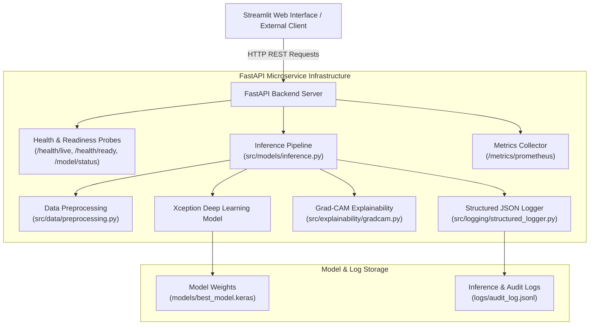

# Explainable Lung Cancer Classification & MLOps Engine

[](https://github.com/Dhanya562004/Explainable-Lung-Cancer-Classification/actions/workflows/ci.yml)

**Live Web Application:** [https://explainable-lung-cancer-classification-uhx8avwtk2utzx78rxrs3z.streamlit.app/](https://explainable-lung-cancer-classification-uhx8avwtk2utzx78rxrs3z.streamlit.app/)

### 🚀 Deployment Infrastructure & Verification Status

| Deployment Target | Implementation Type | Status / Artifact Location |
| :--- | :--- | :--- |
| **Streamlit Web Application** | Frontend User Interface | ✅ **Deployed Live:** [Streamlit Cloud Demo](https://explainable-lung-cancer-classification-uhx8avwtk2utzx78rxrs3z.streamlit.app/) |
| **Kubernetes (K8s)** | Microservice Orchestration & Health Probes | 📄 **Production Manifests Authored:** [`deploy/k8s/`](deploy/k8s/) (Kustomize, Deployment, Service, ConfigMap) |
| **Azure Container Apps (ACA)** | Serverless Cloud Infrastructure as Code | 📄 **Bicep IaC Authored:** [`deploy/azure/`](deploy/azure/) (`azure-container-apps.bicep`, GitHub OIDC `.github/workflows/deploy-azure.yml`) |
| **Docker & Compose** | Container Security & Local Orchestration | ✅ **Multi-stage Dockerfile Authored & Validated:** Non-root runtime user (`UID 10001`), [`docker-compose.yml`](docker-compose.yml) |

---

## Educational & Research Disclaimer

> **⚠️ DISCLAIMER:** This project is developed strictly for **educational, research, and software engineering portfolio purposes**. It is **not** a clinically validated medical diagnostic tool and must **not** be used for clinical decision-making, patient diagnosis, or direct medical treatment.

---

## Project Overview

The system classifies chest CT scan images into four distinct categories (*Adenocarcinoma*, *Large Cell Carcinoma*, *Normal*, and *Squamous Cell Carcinoma*) using fine-tuned transfer learning on the **Xception** architecture. In addition to classification, the system incorporates visual explainability via **Grad-CAM** (Gradient-weighted Class Activation Mapping) to highlight anatomical regions of interest driving model predictions.

The engineering focus of this project spans backend Python microservices, automated CI/CD quality gates, non-root Docker security contexts, Kubernetes manifest design with health probes, and structured operational observability.

---

## Key Features

- **Deep Transfer Learning Engine:** 4-class CT scan classification built on Xception pre-trained ImageNet weights.
- **Visual Explainability (Grad-CAM):** Computes gradient activations from the final convolutional layer to generate interpretable heatmap overlays.
- **Production REST API:** Built with FastAPI, featuring upload file validation (PNG, JPG, JPEG), 10MB payload size boundaries, structured error responses, and HTTP status codes.
- **Health Probes & Telemetry:** Liveness (`/health/live`), readiness (`/health/ready`), model status (`/model/status`), and Prometheus metrics (`/metrics/prometheus`) for operational monitoring.
- **Automated Testing & CI/CD:** GitHub Actions workflow executing a 23-test Pytest suite, Flake8 linting, and Docker container build verification on every push and pull request.
- **Secure Containerization:** Multi-stage Docker image with a non-root runtime user (`appuser`, UID `10001`), container health checks, and Docker Compose orchestration.
- **Kubernetes Manifests:** Production-ready manifests (`deploy/k8s/`) configured with resource requests/limits, startup/liveness/readiness probes, and rolling update strategies.
- **Azure Container Apps Readiness:** Infrastructure as Code Bicep templates (`deploy/azure/`) and manual dispatch deployment workflow with OIDC federated authentication.
- **Performance Benchmarking:** Automated Locust load testing suite (`tests/performance/`) measuring throughput, concurrency, latency distribution (p50, p95, p99), and cold-start behavior.

---

## Architecture Diagram



---

## Technology Stack

| Domain | Technology | Purpose |
| :--- | :--- | :--- |
| **Core Language** | Python 3.10 / 3.11 / 3.12 / 3.13 | Primary application development language |
| **Backend API** | FastAPI, Uvicorn, Pydantic | RESTful API server, async request processing, schema validation |
| **Machine Learning** | TensorFlow, Keras, NumPy, OpenCV, PIL | Model inference, image preprocessing, Grad-CAM visualization |
| **User Interface** | Streamlit | Web application frontend for interactive predictions and monitoring |
| **Testing & Quality** | Pytest, Pytest-Cov, Flake8 | Automated unit/integration test suite, code style enforcement |
| **CI/CD** | GitHub Actions | Automated build, linting, testing, and Docker build workflows |
| **Containerization** | Docker, Docker Compose | Microservice containerization and multi-container orchestration |
| **Orchestration** | Kubernetes (Kustomize) | Microservice deployment, rolling updates, and health probes |
| **Cloud Target** | Azure Container Apps, Bicep, OIDC | Serverless container deployment and infrastructure as code |
| **Observability** | Prometheus Client, Structlog | Operational metrics scraper format and structured JSON logging |
| **Load Testing** | Locust, HTTPX | Performance benchmarking and concurrency testing |

---

## Installation and Local Setup

### Prerequisites
- Python 3.10 or higher
- Git

### 1. Clone Repository & Create Virtual Environment
```bash
git clone https://github.com/Dhanya562004/Explainable-Lung-Cancer-Classification.git
cd Explainable-Lung-Cancer-Classification

# Create virtual environment
python -m venv .venv

# Activate virtual environment
# On Linux/macOS:
source .venv/bin/activate
# On Windows (PowerShell):
.venv\Scripts\activate
```

### 2. Install Dependencies
```bash
pip install --upgrade pip
pip install -r requirements.txt
```

### 3. Run Backend API Server
```bash
uvicorn src.api.server:app --host 0.0.0.0 --port 8000 --reload
```
Access interactive API documentation at: `http://localhost:8000/docs`

### 4. Run Streamlit UI
In a separate terminal window (with `.venv` activated):
```bash
streamlit run app.py
```
Access Streamlit web interface at: `http://localhost:8501`

---

## API Reference

| Method | Path | Summary | Expected Status |
| :--- | :--- | :--- | :--- |
| `GET` | `/` | Root API metadata and medical disclaimer | `200 OK` |
| `GET` | `/health/live` | Process liveness probe | `200 OK` |
| `GET` | `/health/ready` | Model artifact readiness probe | `200 OK` / `503 Service Unavailable` |
| `GET` | `/health` | Comprehensive system, memory, disk, and model health | `200 OK` |
| `GET` | `/model/status` | Model operational diagnostics and parameter count | `200 OK` |
| `GET` | `/model/info` | Active model version and test metrics registry | `200 OK` |
| `POST` | `/predict` | Classify uploaded CT image | `200 OK` / `400 Bad Request` / `413 Payload Too Large` / `500 Error` |
| `GET` | `/metrics` | Official test dataset evaluation metrics | `200 OK` |
| `GET` | `/metrics/prometheus` | Prometheus operational metrics scraper endpoint | `200 OK` |
| `GET` | `/monitoring/summary` | Telemetry summary and verified ground-truth feedback | `200 OK` |
| `POST` | `/feedback` | Submit verified ground-truth label feedback | `200 OK` / `500 Error` |

### Example Request: Classify Image via `/predict`
```bash
curl -X 'POST' \
  'http://localhost:8000/predict' \
  -H 'accept: application/json' \
  -H 'Content-Type: multipart/form-data' \
  -F 'file=@tests/fixtures/sample_ct.png;type=image/png'
```

### Example Response:
```json
{
  "prediction_id": "pred-a1b2c3d4e5",
  "predicted_class": "Adenocarcinoma",
  "confidence": 84.52,
  "confidence_level": "HIGH",
  "probabilities": {
    "Adenocarcinoma": 84.52,
    "Large Cell Carcinoma": 8.12,
    "Normal": 3.24,
    "Squamous Cell Carcinoma": 4.12
  },
  "model_version": "v1.0.0-xception",
  "inference_latency_ms": 312.45,
  "timestamp": "2026-10-09T04:54:20.813036+00:00",
  "requires_human_review": false,
  "recommendation": "Prediction confidence acceptable.",
  "disclaimer": "⚠️ DISCLAIMER: For educational and research purposes only..."
}
```

---

## Testing and Code Quality

The repository contains an automated test suite covering API endpoints, error boundary handling, image preprocessing, model fallback behavior, data drift, and feedback performance metrics.

### Execute Pytest Suite
```bash
python -m pytest -v --tb=short
```

### Execute Flake8 Code Quality Check
```bash
flake8 src/ tests/
```

### Test Suite Summary
- **Total Tests:** `23` unit and integration tests.
- **Pass Rate:** `23 passed, 0 failures`.
- **Code Style:** Compliant with `.flake8` configuration (exit code 0).

---

## Docker and Docker Compose

### Docker Container Security
The [`Dockerfile`](file:///c:/Users/Deeksha/OneDrive/Desktop/Explainable-Lung-Cancer-Classification-main/Dockerfile) is engineered with security best practices:
- Base image: `python:3.10-slim`
- Non-root runtime user (`appuser`, UID `10001`)
- Exposed ports: `8000` (FastAPI) and `8501` (Streamlit)
- Liveness health check query to `/health/live`

### 1. Build Docker Image Locally
```bash
docker build -t explainable-lung-cancer-api:latest .
```

### 2. Run Container
```bash
docker run -d \
  --name lung_cancer_container \
  -p 8000:8000 \
  -p 8501:8501 \
  explainable-lung-cancer-api:latest
```

### 3. Orchestrate with Docker Compose
To launch both FastAPI backend and Streamlit frontend containers simultaneously with internal service discovery:
```bash
docker-compose up --build
```
Stop services:
```bash
docker-compose down
```

---

## Performance and Reliability Benchmarks

Automated load testing was conducted against the running FastAPI service using the load testing suite in [`tests/performance/run_performance_test.py`](file:///c:/Users/Deeksha/OneDrive/Desktop/Explainable-Lung-Cancer-Classification-main/tests/performance/run_performance_test.py).

### Measured Performance Results

| Metric | Measured Value |
| :--- | :--- |
| **Total Prediction Requests Executed** | `15` requests |
| **Test Concurrency** | `3` parallel workers |
| **Successful Requests** | `15` (`100%`) |
| **Failed Requests** | `0` (`0%`) |
| **Error Rate** | `0.00%` |
| **Throughput (RPS)** | `2.80 requests/second` |
| **Warm-up / Cold-Start Model Latency** | `4,637.4 ms` |
| **Minimum Latency** | `330.93 ms` |
| **Average Latency** | `1,014.57 ms` |
| **p50 Latency (Median)** | `975.04 ms` |
| **p95 Latency** | `1,464.12 ms` |
| **p99 Latency** | `1,513.50 ms` |
| **Maximum Latency** | `1,525.85 ms` |

*Note: These benchmark results reflect a single-node CPU execution environment testing cold-start initialization and small-batch concurrency, as recorded in [`results/performance_report.md`](file:///c:/Users/Deeksha/OneDrive/Desktop/Explainable-Lung-Cancer-Classification-main/results/performance_report.md). They demonstrate baseline system resilience rather than large-scale production limits.*

### Run Performance Test Command
```bash
python tests/performance/run_performance_test.py --url http://127.0.0.1:8000 --requests 15 --concurrency 3
```

---

## Kubernetes Deployment Instructions

Production-ready Kubernetes manifests are authored under [`deploy/k8s/`](file:///c:/Users/Deeksha/OneDrive/Desktop/Explainable-Lung-Cancer-Classification-main/deploy/k8s/):
- `configmap.yaml`: Non-sensitive application configuration.
- `deployment.yaml`: Microservice deployments featuring non-root security contexts (`runAsUser: 10001`), resource limits (CPU: 1000m, RAM: 2Gi), and startup, liveness, and readiness probes.
- `service.yaml`: ClusterIP (FastAPI) and NodePort (Streamlit, port 30501) services.
- `kustomization.yaml`: Kustomize orchestration manifest.

### Deploy to Local Cluster (Kind / Minikube)

1. **Start Cluster:**
   ```bash
   kind create cluster --name lung-cancer-cluster
   ```
2. **Build & Load Image:**
   ```bash
   docker build -t explainable-lung-cancer-api:v1.0.0 .
   kind load docker-image explainable-lung-cancer-api:v1.0.0 --name lung-cancer-cluster
   ```
3. **Apply Manifests via Kustomize:**
   ```bash
   kubectl apply -k deploy/k8s/
   ```
4. **Verify Deployment & Probes:**
   ```bash
   kubectl rollout status deployment/fastapi-deployment
   kubectl get pods -l app=explainable-lung-cancer
   ```

*Deployment Status Notice: The Kubernetes manifests are fully authored and structurally validated (`kubectl apply --dry-run=client`). Active cluster deployment requires running a local cluster (Kind/Minikube) or a managed cloud Kubernetes service.*

---

## Azure Container Apps Deployment Instructions

Infrastructure as Code templates and GitHub Action deployment workflows are provided under [`deploy/azure/`](file:///c:/Users/Deeksha/OneDrive/Desktop/Explainable-Lung-Cancer-Classification-main/deploy/azure/):
- `azure-container-apps.bicep`: Bicep template provisioning Azure Container Registry (ACR) and Azure Container Apps (ACA).
- `.github/workflows/deploy-azure.yml`: Manual dispatch workflow with OIDC federated credential authentication.
- `AZURE_DEPLOYMENT.md`: Detailed setup guide and cost estimation ($23–$26/month).

### Deployment via Azure CLI
```bash
# 1. Login to Azure
az login

# 2. Create Resource Group
az group create --name rg-lungcancer-prod --location eastus

# 3. Deploy Infrastructure via Bicep
az deployment group create \
  --resource-group rg-lungcancer-prod \
  --template-file deploy/azure/azure-container-apps.bicep \
  --parameters namePrefix=lungcancer imageTag=v1.0.0
```

*Deployment Status Notice: Cloud deployment configuration files are complete and ready for execution. Provisioning resources on Azure requires an active Azure subscription and user credentials.*

---

## Monitoring, Health Checks and Structured Logging

### Health Probes
- **Liveness Probe (`GET /health/live`):** Returns `200 OK` if the process is responsive. Used by Kubernetes and Docker to restart unhealthy containers.
- **Readiness Probe (`GET /health/ready`):** Returns `200 OK` when model weights are initialized and ready to serve inferences; returns `503 Service Unavailable` if unready.
- **Model Status (`GET /model/status`):** Returns parameter counts, input dimensions, and model load status without exposing internal server file paths.

### Operational Observability
- **Prometheus Metrics (`GET /metrics/prometheus`):** Exposes counters for prediction requests (`api_predictions_total`), confidence distribution (`api_predictions_by_confidence_total`), and total latency.
- **Structured JSON Logging:** Implemented in [`src/logging/structured_logger.py`](file:///c:/Users/Deeksha/OneDrive/Desktop/Explainable-Lung-Cancer-Classification-main/src/logging/structured_logger.py), generating JSON-formatted log entries suitable for Azure Log Analytics or Datadog without recording patient PII or raw image bytes.

---

## Project Structure

```text
Explainable-Lung-Cancer-Classification/
├── .github/
│   └── workflows/
│       ├── ci.yml                     # Continuous Integration workflow
│       └── deploy-azure.yml           # Azure Container Apps deployment workflow
├── deploy/
│   ├── azure/
│   │   ├── AZURE_DEPLOYMENT.md        # Azure setup & pricing documentation
│   │   └── azure-container-apps.bicep # Infrastructure as Code template
│   └── k8s/
│       ├── README.md                  # Kubernetes deployment guide
│       ├── configmap.yaml             # ConfigMap environment settings
│       ├── deployment.yaml            # Pod deployments with health probes
│       ├── kustomization.yaml         # Kustomize manifest orchestration
│       └── service.yaml               # ClusterIP & NodePort services
├── models/
│   ├── model_registry.json            # Model registry version metadata
│   └── best_model.keras               # Trained Keras model weights
├── results/
│   ├── confusion_matrix.png           # Test dataset evaluation plot
│   ├── evaluation_metrics.json        # Test evaluation metric values
│   └── performance_report.md          # Saved Locust load benchmark report
├── src/
│   ├── api/
│   │   └── server.py                  # FastAPI REST server & health endpoints
│   ├── data/
│   │   ├── ingestion.py               # Dataset directory scanner
│   │   ├── preprocessing.py           # Image validation & tensor formatting
│   │   └── validation.py              # Dataset integrity check
│   ├── evaluation/
│   │   ├── evaluate.py                # Test dataset evaluation runner
│   │   └── metrics.py                 # Classification metrics computer
│   ├── explainability/
│   │   └── gradcam.py                 # Grad-CAM heatmap overlay generator
│   ├── features/
│   │   └── feature_pipeline.py        # Xception feature vector extractor
│   ├── logging/
│   │   ├── audit_logger.py            # Audit event recorder
│   │   └── structured_logger.py       # Production JSON formatter
│   ├── models/
│   │   ├── inference.py               # Prediction execution engine
│   │   ├── model.py                   # Xception architecture builder
│   │   └── model_registry.py          # Registry loader & model info
│   └── monitoring/
│       ├── drift.py                   # Input data drift detector
│       ├── health.py                  # System resources & storage health
│       ├── latency.py                 # Latency statistics computer
│       ├── performance.py             # Ground-truth feedback tracker
│       └── telemetry.py               # Prometheus metrics collector
├── tests/
│   ├── fixtures/
│   │   └── sample_ct.png              # Test CT scan image fixture
│   ├── performance/
│   │   ├── locustfile.py              # Locust load testing tasks
│   │   └── run_performance_test.py    # Benchmark CLI runner script
│   ├── test_api.py                    # Core API endpoint unit tests
│   ├── test_api_reliability.py        # Health probe & boundary error tests
│   ├── test_model_loading.py          # Model fallback & health check tests
│   ├── test_monitoring.py             # Telemetry & drift monitoring tests
│   ├── test_prediction.py             # Inference output schema tests
│   └── test_preprocessing.py          # Preprocessing validation tests
├── .dockerignore                       # Docker build context exclusions
├── .flake8                             # Code style linter configuration
├── .gitignore                          # Git tracking exclusion patterns
├── Dockerfile                          # Multi-stage container definition
├── docker-compose.yml                  # Local multi-service orchestration
├── app.py                              # Streamlit web frontend
├── conftest.py                         # Pytest configuration
├── requirements.txt                    # Pinned Python dependencies
└── README.md                           # Master project documentation
```

---

## Limitations and Future Improvements

### Current Limitations
- **Educational Scope:** Evaluated on public benchmark CT scan splits; performance may vary across different scanner manufacturers or slice thickness parameters.
- **CPU Inference Latency:** Model inference relies on single-node CPU execution. High-throughput real-time deployment requires GPU hardware acceleration (TensorRT / ONNX Runtime).
- **Model Storage:** The Keras model weights are packaged directly into the repository or downloaded via ImageNet fallback; production setups should use external object storage (Azure Blob / AWS S3) with persistent volume mounts.

### Future Enhancements
- **ONNX Runtime Optimization:** Export Xception model to ONNX format for faster CPU/GPU inference latency.
- **Automated Retraining Pipeline:** Implement automated trigger pipelines using Airflow or Kubeflow when verified ground-truth feedback indicates accuracy degradation.
- **Authentication & Authorization:** Integrate OAuth2 / JWT authentication middleware for REST API endpoints.
